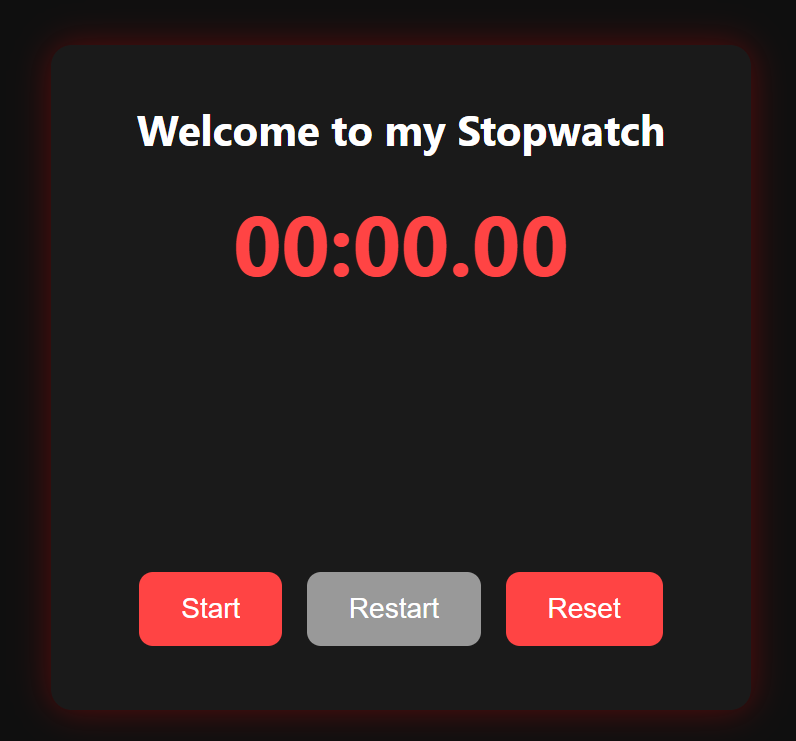

# ⏱️ Stopwatch Web App

A sleek and responsive stopwatch built using **HTML, CSS, and JavaScript**. This stopwatch can start, stop, reset, and restart with millisecond precision and an appealing dark-themed UI.

## 🚀 Features

- ✅ Start, Stop, Reset, and Restart functionality
- ✅ Millisecond-accurate time tracking
- ✅ Beautiful glowing UI with dark mode styling
- ✅ Smooth transitions and button animations
- ✅ Fully responsive design for mobile and desktop

## 🧩 Measured Features

- ⏰ **Accuracy**: Tracks time down to **hundredths of a second** (00.00 format)
- 🔁 **Restart Functionality**: Instantly resets and starts a fresh timer
- ⏹️ **Stop Button Logic**: Freezes the current time without resetting
- 🧼 **Reset Button Logic**: Clears time back to 00:00.00 and awaits new start
- 💡 **User Feedback**: Button states and visibility guide the user flow clearly
- 🎨 **Visual Design**: Centered dark-themed card with glowing red shadows for readability

## 🖼 Screenshot

> Clean and minimalist interface with glowing red highlight

## 🎥 Demo

🎬 *Watch the working demo:*  
[Click here to view the demo video](./vid.mp4) <!-- Replace # with your video link (YouTube/GitHub video upload) -->

## 🔗 Live Demo
[View the Project on Vercel](https://to-do-list-suryabhan-singhs-projects.vercel.app/)
